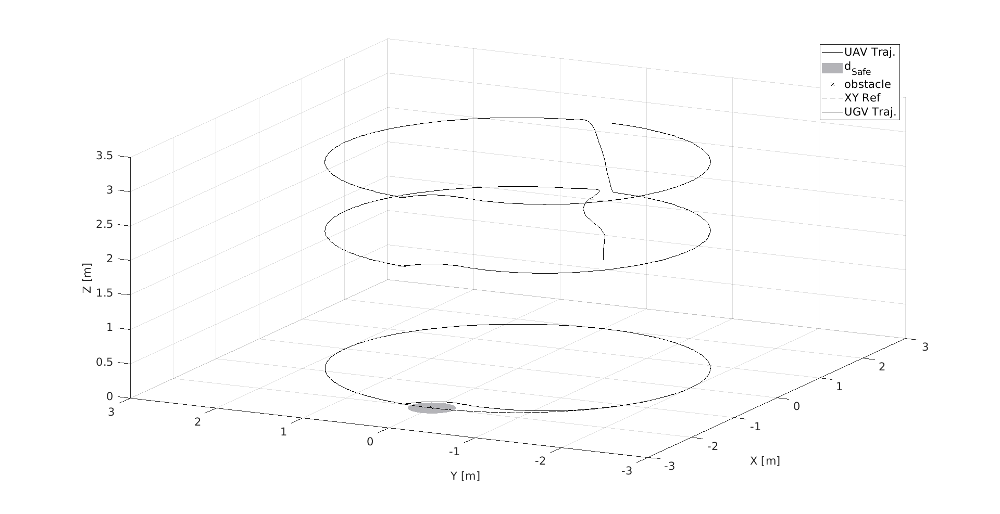

Once it has been run the Simulink model, in the out variable are stored all data from the simulation. 
The out variable has been saved in the **out** file.

Run the **ResultsScript** script to plot all figures. The .fig file has been obtained by running the indicated file.
<p align="center">

</p>
The following text is also displayed

```shell
  TABLE II : UAV NMPC Performances
Tracking Pred. Err. (47)
RMSEx = 8.275768e-02 RMSEy = 8.703003e-02 RMSEz = 8.938460e-02 RMSEpsi = 5.994507e-02
Tracking Ref. Err. (48)
RMSEx = 7.558942e-02 RMSEy = 1.735671e-01 RMSEz = 8.938460e-02 RMSEpsi = 1.296436e-01
  TABLE III : UAV MHE Performances
Estimation. Err.
RMSEx1 = 1.054089e-03 RMSEx2 = 2.410932e-02 RMSEy1 = 1.005057e-03 RMSEy2 = 2.274957e-02 RMSEz1 = 2.585591e-03 RMSEz2 = 1.400863e-03
RMSEtheta1 = 1.630620e-02 RMSEtheta2 = 5.250383e-02 RMSEphi1 = 1.591704e-02 RMSEphi2 = 5.045114e-02 RMSEpsi1 = 1.276967e-03 RMSEpsi2 = 4.213466e-03
>>
```