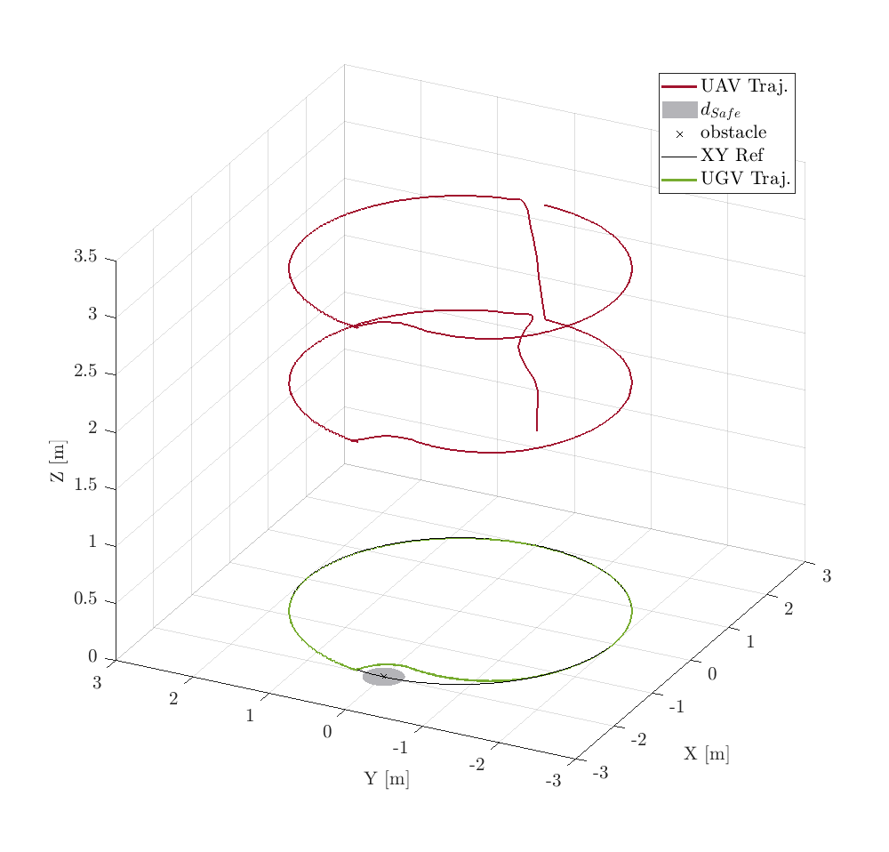

Once it has been run the Simulink model, in the out variable are stored all data from the simulation. 
The out variable has been saved in the **out** file.

Run the **ResultsScript** script to plot all figures. The .fig file has been obtained by running the indicated file.
<p align="center">

</p>
The following text is also displayed

```shell
TABLE II : UAV NMPC Performances
Tracking Pred. Err. (47)
RMSEx = 8.297399e-02 RMSEy = 8.742779e-02 RMSEz = 8.938467e-02 RMSEpsi = 6.543148e-02
Tracking Ref. Err. (48)
RMSEx = 8.066296e-02 RMSEy = 2.000037e-01 RMSEz = 8.938467e-02 RMSEpsi = 1.516303e-01
  TABLE III : UAV MHE Performances
Estimation. Err.
RMSEx1 = 1.054090e-03 RMSEx2 = 2.410932e-02 RMSEy1 = 1.005057e-03 RMSEy2 = 2.274956e-02 RMSEz1 = 2.585591e-03 RMSEz2 = 1.400879e-03
RMSEtheta1 = 1.630620e-02 RMSEtheta2 = 5.250384e-02 RMSEphi1 = 1.591703e-02 RMSEphi2 = 5.045113e-02 RMSEpsi1 = 1.276654e-03 RMSEpsi2 = 4.180425e-03
>>
```

To have a topview of the trajectories, run the following command
```shell
>> figure(1); view(0, 90);
```
<p align="center">

</p>