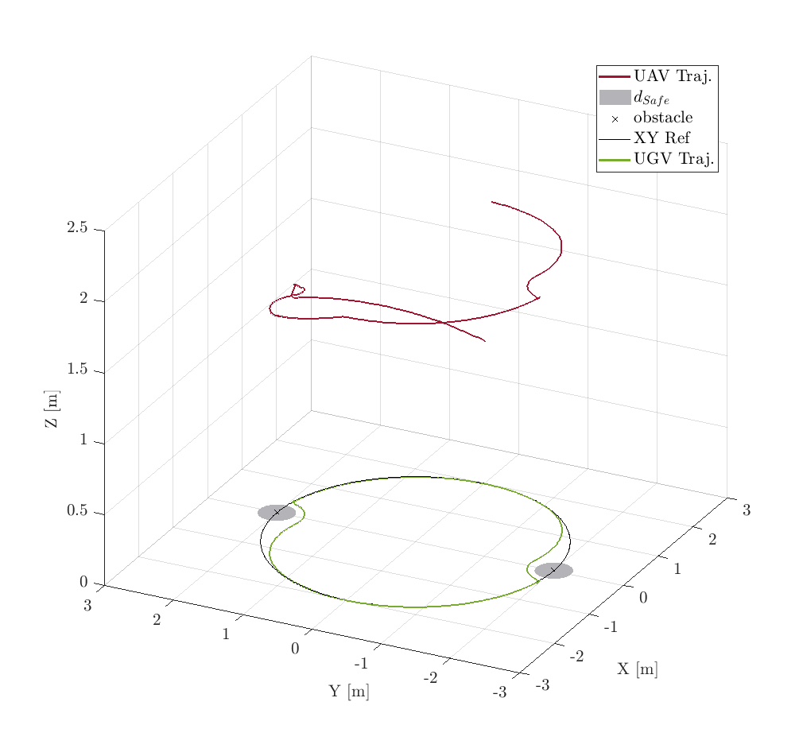

Once it has been run the Simulink model, in the out variable are stored all data from the simulation. 
The out variable has been saved in the **out_Scenario2** file.

Copy all the MATLAB functions in the [results](../../../Scenario_n1/Quadcopter/results) folder of the first scenario in this folder.

Run the **ResultsScript** script to plot all figures. The .fig file has been obtained by running the indicated file.
<p align="center">

</p>
The following text is also displayed

```shell
TABLE II : UAV NMPC Performances
Tracking Pred. Err. (47)
RMSEx = 9.052384e-02 RMSEy = 8.284531e-02 RMSEz = 7.986631e-03 RMSEpsi = 8.582025e-02
Tracking Ref. Err. (48)
RMSEx = 2.800412e-01 RMSEy = 9.075316e-02 RMSEz = 7.986631e-03 RMSEpsi = 2.143003e-01
  TABLE III : UAV MHE Performances
Estimation. Err.
RMSEx1 = 4.487624e-05 RMSEx2 = 1.144898e-03 RMSEy1 = 6.869461e-05 RMSEy2 = 1.215953e-03 RMSEz1 = 1.477444e-05 RMSEz2 = 4.926916e-05
RMSEtheta1 = 1.025094e-03 RMSEtheta2 = 3.878854e-03 RMSEphi1 = 1.025277e-03 RMSEphi2 = 3.879523e-03 RMSEpsi1 = 1.290658e-03 RMSEpsi2 = 4.186537e-03
>>
```

To have a topview of the trajectories, run the following command
```shell
>> figure(1); view(0, 90);
```
<p align="center">

</p>
