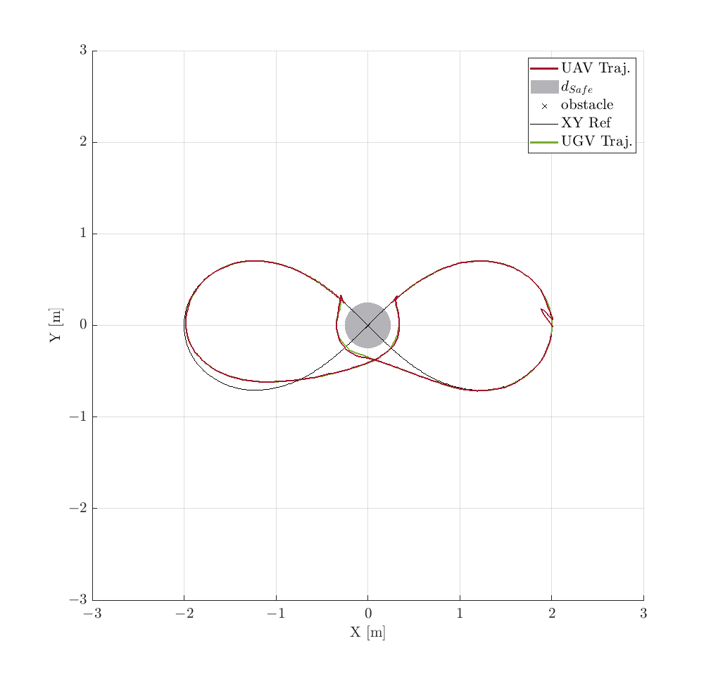

Once it has been run the Simulink model, in the out variable are stored all data from the simulation. 
The out variable has been saved in the **out_Scenario2** file.

Copy all the MATLAB functions in the [results](../../../Scenario_n1/Quadcopter/results) folder of the first scenario in this folder.

Run the **ResultsScript** script to plot all figures. The .fig file has been obtained by running the indicated file.
<p align="center">

</p>
The following text is also displayed

```shell
  TABLE II : UAV NMPC Performances
Tracking Pred. Err. (47)
RMSEx = 9.157175e-02 RMSEy = 7.010127e-02 RMSEz = 8.462259e-02 RMSEpsi = 9.533556e-02
Tracking Ref. Err. (48)
RMSEx = 3.629012e-01 RMSEy = 2.163224e-01 RMSEz = 8.462259e-02 RMSEpsi = 2.899516e-01
  TABLE III : UAV MHE Performances
Estimation. Err.
RMSEx1 = 8.143585e-04 RMSEx2 = 1.844036e-02 RMSEy1 = 1.247012e-03 RMSEy2 = 2.818716e-02 RMSEz1 = 2.566922e-03 RMSEz2 = 1.126111e-03
RMSEtheta1 = 1.222935e-02 RMSEtheta2 = 3.923462e-02 RMSEphi1 = 1.968585e-02 RMSEphi2 = 6.208569e-02 RMSEpsi1 = 1.291964e-03 RMSEpsi2 = 4.212242e-03
>>
```

To have a topview of the trajectories, run the following command
```shell
>> figure(1); view(0, 90);
```
<p align="center">

</p>
