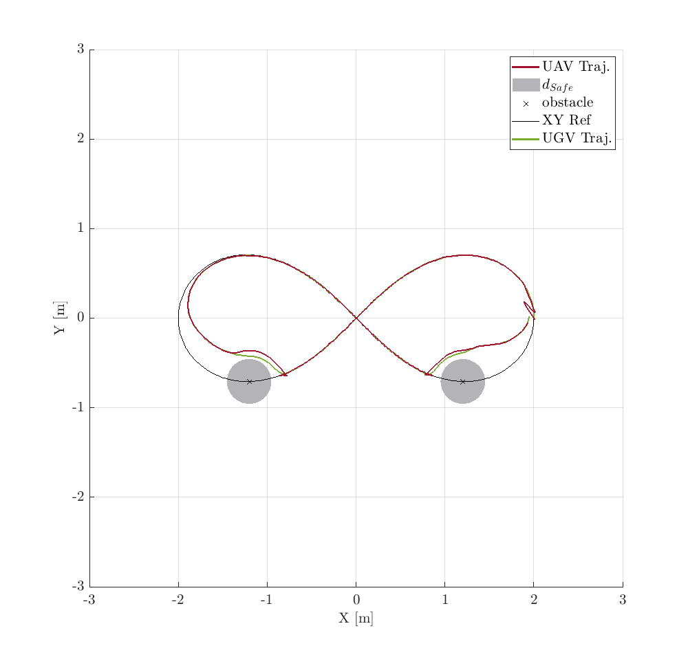

Once it has been run the Simulink model, in the out variable are stored all data from the simulation. 
The out variable has been saved in the **out_Scenario4** file.

Copy all the MATLAB functions in the [results](../../../Scenario_n1/Quadcopter/results) folder of the first scenario in this folder apart the **PlotResults** MATLAB function. Moreover, copy the MATLAB function [drawObstacle3DNoShowed](../../../Scenario_n2/Quadcopter/results/drawObstacle3DNoShowed.m) from the second scenario.

Run the **ResultsScript** script to plot all figures. The .fig file has been obtained by running the indicated file.
<p align="center">

</p>
The following text is also displayed

```shell
  TABLE II : UAV NMPC Performances
Tracking Pred. Err. (47)
RMSEx = 8.219910e-02 RMSEy = 6.103607e-02 RMSEz = 1.124693e-01 RMSEpsi = 9.200836e-02
Tracking Ref. Err. (48)
RMSEx = 2.535090e-01 RMSEy = 6.298446e-02 RMSEz = 1.124693e-01 RMSEpsi = 2.183838e-01
  TABLE III : UAV MHE Performances
Estimation. Err.
RMSEx1 = 8.143584e-04 RMSEx2 = 1.844036e-02 RMSEy1 = 1.247013e-03 RMSEy2 = 2.818716e-02 RMSEz1 = 2.566922e-03 RMSEz2 = 1.126078e-03
RMSEtheta1 = 1.222935e-02 RMSEtheta2 = 3.923463e-02 RMSEphi1 = 1.968586e-02 RMSEphi2 = 6.208569e-02 RMSEpsi1 = 1.291964e-03 RMSEpsi2 = 4.212241e-03
>>
```

To have a topview of the trajectories, run the following command
```shell
>> figure(1); view(0, 90);
```
<p align="center">

</p>
